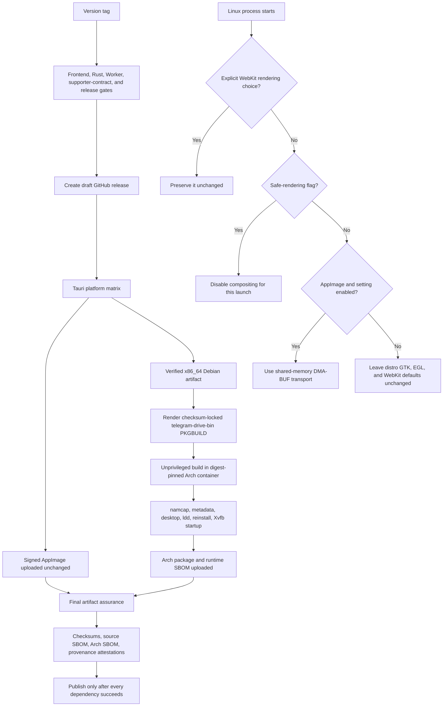

# Linux and Arch compatibility implementation plan

Status: implemented locally; CI and real-device acceptance remain required before a release is published.

## Assessment of the original plan

The original plan was not safe to execute verbatim.

1. The proposed unconditional Rust environment change duplicated an existing pre-WebKit startup hook and would have overridden the existing user preference.
2. The release workflow modified the local AppImage only after `tauri-action` had signed and uploaded the release artifact. The published artifact therefore did not receive the patch; re-uploading a modified copy would invalidate the updater signature and metadata.
3. The replacement `AppRun` changed accessibility, locale, graphics-library loading, EGL selection, and media paths together. That blast radius was too large for an unconfirmed DMA-BUF diagnosis.
4. The proposed PKGBUILD used the wrong source/build paths, treated a Debian `ar` archive as a tar archive, installed under `/usr/local`, used a floating source, skipped integrity verification, and named a source build as a `-bin` package.
5. It declared MIT even though the repository has no checked-in license text. That must not be invented, and it blocks responsible AUR publication.
6. It did not account for updater ownership. A Tauri Linux self-update must not replace files owned by pacman.

## Upgraded design

## Compatibility rules

- Never mutate AppImage/updater bytes after signing or upload.
- Never force `GDK_BACKEND` or `EGL_PLATFORM` globally.
- Never remove caller-provided rendering environment variables.
- Preserve the existing `linuxRenderingFix` setting and default so upgrades remain compatible.
- Honor `XDG_DATA_HOME` when locating the existing settings file.
- Keep the normal native `.deb`, `.rpm`, and pacman rendering path on distribution WebKitGTK defaults.
- Keep application identifier, app-data paths, secure credential service/account names, supporter token format, recovery behavior, price, lifetime entitlement, ad suppression, and three-device allowance unchanged.
- Package only system-owned files under `/usr`; never package or remove user data.
- Let pacman own updates for `.pkg.tar.zst` installations.
- Do not publish to AUR until an intended license file is checked in and publication is explicitly authorized.

## Implemented phases

### 1. Rendering policy

- Refactored startup selection into unit-testable pure decisions.
- Scoped the automatic fallback to AppImage runtime variables.
- Replaced the legacy blanket disablement with `WEBKIT_DMABUF_RENDERER_FORCE_SHM=1`.
- Added `TELEGRAM_DRIVE_SAFE_RENDERING=1` as a launch-time last resort.
- Preserved all explicit environment values and stopped forcing Wayland/EGL.
- Added package/rendering values to copied diagnostics.
- Updated the rendering preference description in all 24 shipped locales.

### 2. Signed artifact integrity

- Removed the post-upload AppImage extraction/repacking block.
- Added a regression gate that rejects AppImage mutation tooling or broad `AppRun` overrides after `tauri-action`.

### 3. Arch package

- Added a checksum-rendered `telegram-drive-bin` recipe that consumes the exact release `.deb`.
- Preserved the upstream ELF bytes with `!strip`/`!debug` and renamed only the installed system paths.
- Added a stable launcher, desktop entry, icon identifier, runtime dependencies, and transparent upstream-license notice.
- Marked the launched app as pacman-managed without changing the Tauri application identifier or data paths.

### 4. Updater ownership

- Added a native installation-info command.
- Retained update checks for pacman installs but changed the install action to open the verified release instead of running Tauri installation against `/usr`.
- Kept existing AppImage, Windows, macOS, and Android install behavior unchanged.

### 5. CI and release assurance

- Added PR/main Arch package-contract CI against a SHA-256-pinned upstream fixture.
- Added a release Arch job downstream of the already-protected Tauri build.
- Added package structure, dependency, desktop-entry, user-data exclusion, reinstall, and headless startup checks.
- Added a resolved Arch runtime CycloneDX SBOM and package-specific SBOM attestation.
- Made final assurance wait for the Arch package before checksums/provenance are generated.
- Removed hard-coded application versions from source and Android SBOM generators.

### 6. Documentation and rollout

- Added package selection, installation, updater ownership, safe-mode, diagnostics, rollback, and AUR-status guidance.
- Added the Arch asset to README and product-site download discovery.
- Kept the AUR step out of automation.

## Acceptance gates

Automated gates:

- frontend unit tests and coverage;
- production frontend build and bundle ceilings;
- localization structure, variables, copied-English baseline, and literal-debt ceiling;
- Rust format, strict Clippy, full native library tests, and supporter-focused tests;
- Worker type-check, tests, and Wrangler dry-run;
- Playwright visual and Axe accessibility tests;
- PKGBUILD checksum/source validation, `.SRCINFO`, `namcap`, `desktop-file-validate`, package metadata/content checks, unresolved-library detection, clean pacman install/reinstall, Xvfb startup, SBOM generation, final checksums, and attestations.

Manual release-candidate gates:

- current EndeavourOS or Arch under Wayland with Mesa;
- the GPU/driver family from the original failure report, including proprietary NVIDIA if applicable;
- at least one X11 session;
- AppImage and pacman package launch, resize, sign-in, file browsing, previews/media, accessibility bridge, tray, and update check;
- install a previous Arch package, activate/restore a supporter entitlement, install the candidate with pacman, and confirm activation and recovery remain intact.

## Rollback

If the AppImage fallback regresses, disable the existing Linux Rendering Fix preference or launch with an explicit reviewed WebKit variable; native packages are unaffected by the automatic policy. If the Arch package regresses, keep the release draft, remove no user data, correct the package recipe, and rebuild from the unchanged verified `.deb`. If a problem escapes publication, install the previous package with pacman and retain the application data and secure credential identifiers.

No AUR repository, live payment, production Worker, D1 data, signing key, supporter entitlement, or published GitHub release was changed while executing this plan.
