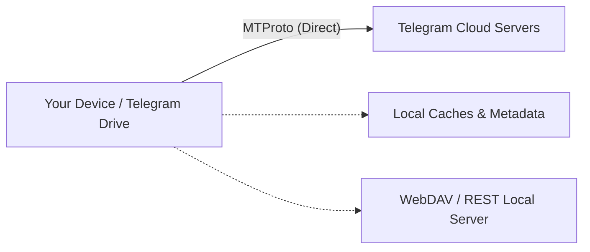

<div align="center">


# Telegram Drive

### A fast, private, local-first file workspace powered by your Telegram account

Organize, upload, download, stream, sync, and manage files stored in your Telegram Saved Messages and channels on **Windows**, **macOS**, **Linux**, and **Android**.

[](LICENSE)
[](https://github.com/jupiterbania/Telegram-Drive)
[](https://github.com/jupiterbania/Telegram-Drive/releases)

[Features](#key-features) • [Getting Started](#getting-started) • [How It Works](#how-it-works) • [Build From Source](#build-from-source) • [License](#license)

</div>

---

## Overview

**Telegram Drive** turns your Telegram account into an organized, high-performance cloud storage drive. It connects directly to Telegram servers using official MTProto protocols without any intermediary servers or relays.

Every file transfer stays strictly between your device and Telegram's infrastructure, ensuring absolute privacy, high speeds, and full control over your data.

> [!NOTE]
> Telegram Drive is an independent open-source project and is not affiliated with Telegram FZ-LLC. File operations remain subject to standard Telegram account limits (up to 2,000,000,000 bytes / 2 GB per file).

---

## Key Features

### 📁 Advanced File Management
- **Channel-based Folders**: Use private Telegram channels as structured cloud folders.
- **Saved Messages Workspace**: Instant access to your personal cloud root.
- **Virtualized Grid & List Views**: Smooth browsing even with tens of thousands of files.
- **Drag & Drop**: Seamlessly drag files and folders to upload directly.
- **Search & Filter**: Real-time search, sorting by date/size/type, and custom filtering.

### ⚡ Blazing Fast Transfers
- **Direct MTProto Connection**: High-speed multi-part parallel transfers directly to Telegram data centers.
- **Robust Queue Engine**: Pause, resume, retry, and manage priority for heavy transfers.
- **Background Transfers**: Runs quietly in the background without interrupting your workflow.
- **File Integrity Validation**: Automatic checksum verification for reliable uploads and downloads.

### 🎬 Built-in Media Player & Previews
- **Instant Video Streaming**: Adaptive video streaming (HLS/fast start) with playback speed, audio tracks, and subtitle support.
- **Rich Media Preview**: In-app image gallery, audio player with playlist management, and PDF reader.
- **Archive Explorer**: Inspect and extract compressed archives directly.

### 🔄 Desktop Folder Sync & WebDAV
- **Folder Sync**: Automatically keep local directories synchronized with your designated Telegram channels.
- **WebDAV Server**: Mount your Telegram storage directly as a local drive letter in Windows Explorer, macOS Finder, or Linux file managers.
- **Local REST API**: Script and automate file operations via local loopback endpoints.

### 🔐 Client-Side Encryption
- **End-to-End Encryption**: Encrypt sensitive files locally using AES-GCM before uploading.
- **Zero-Knowledge Privacy**: Passphrases and encryption keys never leave your device.

### 🎨 Modern UI & Multilingual
- **Theme Engine**: Sleek dark and light themes with customizable accent colors and glassmorphism styling.
- **24+ Languages**: Full internationalization support with automatic locale detection.

---

## Getting Started

### Prerequisites: Telegram API Credentials

Telegram requires third-party applications to authenticate using an application `API ID` and `API Hash`:

1. Visit [my.telegram.org](https://my.telegram.org) and log in with your Telegram account phone number.
2. Navigate to **API development tools**.
3. Create a new application (you can name it `Telegram Drive`).
4. Copy the generated **`api_id`** and **`api_hash`**.

### Installation & Login

1. Download the latest version for your operating system from [Releases](https://github.com/jupiterbania/Telegram-Drive/releases).
2. Launch **Telegram Drive**.
3. Enter your **`api_id`** and **`api_hash`**.
4. Log in using your Telegram phone number (OTP code) or scan the QR code.
5. You're ready! Browse **Saved Messages** or create channels to organize your files into folders.

---

## How It Works



- **Zero Relay Servers**: Direct communication between your app and Telegram.
- **Local Cache**: Thumbnails, metadata, and queues are cached locally on your device for instant responsiveness.
- **Direct Storage**: Files are stored securely in your private Telegram cloud chat threads.

---

## Build From Source

### Requirements
- **Node.js** (v18+) & **pnpm** / **npm**
- **Rust** & **Cargo** (latest stable)
- Platform-specific build tools:
  - **Windows**: Visual Studio C++ Build Tools & WebView2
  - **macOS**: Xcode Command Line Tools
  - **Linux**: `libwebkit2gtk-4.1-dev`, `build-essential`, `curl`, `wget`, `file`, `libssl-dev`, `libgtk-3-dev`, `libayatana-appindicator3-dev`, `librsvg2-dev`

### Desktop Build Steps

```bash
# 1. Clone the repository
git clone https://github.com/jupiterbania/Telegram-Drive.git
cd Telegram-Drive/app

# 2. Install dependencies
npm install

# 3. Run in development mode
npm run tauri dev

# 4. Build production bundle
npm run tauri build
```

---

## Security & Privacy

- **Local-First Security**: Secrets, sessions, and hashes are stored in your operating system's native secure credential manager (Windows Credential Manager, macOS Keychain, Linux Secret Service, Android Keystore).
- **No Telemetry by Default**: Privacy is respected by default. No analytics or private metadata are gathered.
- For detailed information, see [PRIVACY.md](PRIVACY.md) and [SECURITY.md](SECURITY.md).

---

## License

Distributed under the MIT License. See [LICENSE](LICENSE) for more information.
